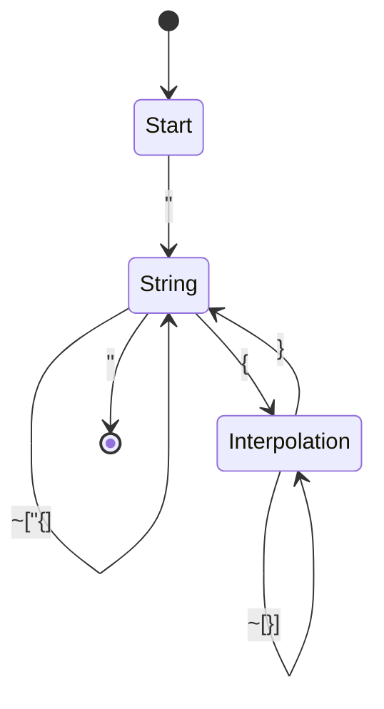
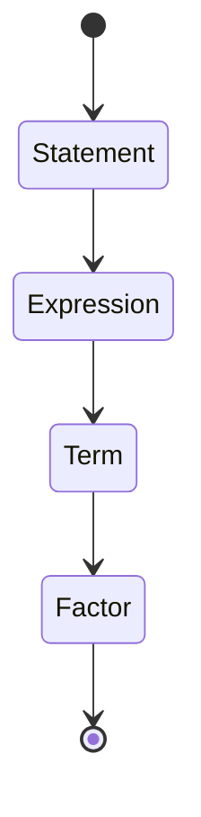

# RFC-001: Syntax and Grammar Design

## Table of Contents
1. [Summary](#1-summary)
2. [Motivation](#2-motivation)
3. [Impact](#3-impact)
   1. [Developer Experience](#31-developer-experience)
   2. [Ecosystem](#32-ecosystem)
   3. [Performance](#33-performance)
4. [Design Decisions](#4-design-decisions)
   1. [Lexical Structure](#41-lexical-structure)
   2. [Declarations](#42-declarations)
   3. [Types](#43-types)
   4. [Expressions](#44-expressions)
   5. [Statements](#45-statements)
   6. [Module & Macro Forms](#46-module--macro-forms)
5. [Drawbacks](#5-drawbacks)
6. [Security & Privacy](#6-security--privacy)
7. [Implementation Plan](#7-implementation-plan)
8. [Migration Strategy](#8-migration-strategy)
9. [Unresolved Questions](#9-unresolved-questions)
10. [Future Possibilities](#10-future-possibilities)
11. [References](#11-references)

## 1. Summary
This RFC specifies the initial version (v0.1) of the Ferra programming language syntax using Extended Backus-Naur Form (EBNF). The grammar is designed to be suitable for a parser leveraging Pratt parsing for expressions, with GLR as a fallback for ambiguous constructs.

## 2. Motivation
Ferra's syntax aims to:
- Provide a clean, intuitive syntax that balances Python-like readability with Rust-like explicitness
- Support both brace-based and indentation-based block structures
- Enable efficient parsing through Pratt parsing for expressions
- Maintain Unicode support for identifiers
- Offer flexible statement termination through newlines and optional semicolons

## 3. Impact
### 3.1 Developer Experience
- Familiar syntax for Python and Rust developers
- Flexible block structure (braces or indentation)
- Clear operator precedence and associativity
- Comprehensive error messages for syntax errors

### 3.2 Ecosystem
- Standardized syntax across the ecosystem
- Consistent code formatting rules
- Clear guidelines for syntax extensions

### 3.3 Performance
- Efficient parsing through Pratt parsing
- Minimal lexer complexity
- Fast syntax error recovery

## 4. Design Decisions

### 4.1 Lexical Structure

  (* This section details the low-level lexical elements of Ferra. These are typically processed by a lexer (tokenizer) before the parser constructs the Abstract Syntax Tree. *)

  1.1 Whitespace & Significant Indentation

      (* General Whitespace *)
      (*   Whitespace characters such as space (U+0020), horizontal tab (U+0009),
           are generally insignificant between tokens. They serve to separate tokens.
           Multiple whitespace characters are usually treated as one.
      *)

      (* Newlines & Statement Termination *)
      (*   The Ferra language is newline-sensitive for statement termination, aiming for a balance
           between Python-like readability and the explicitness available in languages like Rust or Swift.
      *)
      NEWLINE ::= (* Represents one or more platform-agnostic newline characters. The lexer emits a raw NEWLINE token (or equivalent) upon encountering a physical line break not within a multi-line construct like a block comment or multi-line string literal. *)

      (* General Rules for Newlines as Statement Terminators:
         1. A physical NEWLINE token, after lexing, generally signals the end of a statement.
         2. Explicit Semicolon: A semicolon `;` always terminates a statement. It can be used to separate multiple statements on a single line.
         3. Suppression of NEWLINE termination: A NEWLINE token does NOT terminate a statement if the preceding token on the line indicates incompleteness.
            The parser, when deciding if a NEWLINE acts as a terminator, will consider the preceding token.
            A line is considered "clearly incomplete" if the last token before the NEWLINE is one of:
              - An opening delimiter: `(`, `[`, `{` (when its corresponding closer has not yet been seen at the same nesting level).
              - A comma `,`.
              - A dot `.` (for member access).
              - An infix or prefix operator that typically expects a subsequent operand (e.g., `+`, `-`, `*`, `/`, `%`, `<<`, `>>`, `&`, `^`, `|`, `&&`, `||`, `??`, `=`, `+=`, etc., and unary `!`, `-`, `+`).
              - The `->` arrow for function return types.
              - The error propagation operator `?` when used in a postfix position.
              - The `async` or `fn` keywords if a function signature is incomplete.
              - The `let` or `var` keywords if a variable declaration is incomplete.
              - The `data` keyword if a data declaration is incomplete.
              - The `match` keyword if the expression or block is incomplete.
         4. Closing Brace: Inside `{ ... }` blocks, the closing brace `}` also implicitly terminates the last statement within the block if that statement isn't already terminated by a newline or semicolon.
         5. Explicit Line Continuation: (Deferred for now) A backslash `\` at the very end of a line could be introduced later if needed for explicit line continuation, but is not part of the v0.1 grammar.

         The parser is responsible for disambiguating whether a NEWLINE acts as a statement terminator or as insignificant whitespace based on these rules.
         This allows for code like:
           let total = a
               + b      // NEWLINE after `+` is suppressed
               + c      // NEWLINE after `+` is suppressed

           fetch(url)        // NEWLINE after `)` is suppressed if part of a larger expression/chain
               .await?      // NEWLINE after `?` is suppressed
               .json()

           let x = 1; let y = 2 // Explicit semicolons
      *)

      (* Significant Indentation *)
      (*   Ferra supports significant indentation for defining blocks of code, offering a Python-like alternative
           to explicit curly braces. The lexer **MUST** track indentation levels at the start of
           each logical line (i.e., after handling line continuations if any, though explicit line
           continuation characters like `\` are deferred for v0.1).

           - An `INDENT` token is emitted when a new logical line has a greater indentation level
             than the previous logical line (and is not empty or a comment-only line).
           - A `DEDENT` token is emitted when a new logical line has a lesser indentation level.
             Multiple `DEDENT` tokens may be emitted if the indentation decreases by several levels.
           - `NEWLINE` tokens are still emitted as usual at the end of logical lines. The parser will
             use these in conjunction with `INDENT`/`DEDENT` and the statement termination rules.
           - Empty lines or lines containing only whitespace and/or comments do not affect the current
             indentation level for token emission purposes.
           - The exact number of spaces or tabs constituting an indentation level should be consistent
             within a given indented block. Mixing tabs and spaces for indentation at the same level
             is typically an error or discouraged.

           This mechanism allows `Block` structures to be defined either by braces or by indentation.
      *)

      (* Style Hygiene & Error Diagnostics for Indentation and Braces *)
      (*
         While Ferra offers flexibility in block structuring, specific rules prevent ambiguity and promote clarity:
         1.  **Exclusive Choice per Block**: A single syntactic block **MUST** use either curly braces `{...}` OR significant
             indentation. It is a compile-time error to mix these for the *same* block (e.g., opening with `{`
             and then relying on dedentation to close it, or vice-versa).
             Example Error: `if condition { indent_statement_1 // ERROR: Mixed style`

         2.  **Consistent Indentation**: Within an `IndentedBlock`, all statements **MUST** be at the same increased
             indentation level relative to the line that introduced the block. Inconsistent indentation within
             the same logical block level is an error.
             Example Error: `fn foo():
                              INDENT
                                  let x = 1
                                let y = 2 // ERROR: Inconsistent indentation for statement y`

         3.  **Expected Indentation**: If a construct implies a block but no `{` is found (and the syntax allows
             an indented block), an `INDENT` token (or a statement at an increased indent level) is expected.
             Failure to indent will result in a compile-time error.
             Example Error: `fn bar():
                            let x = 1 // ERROR: Expected indented block or single statement on same line after definition`

         Nested blocks can independently choose their style (braces or indentation).
         A code formatter (`ferrafmt`) will have a canonical style (e.g., braces for multi-line blocks by default)
         and may offer options to convert between styles.
      *)

  1.2 Comments
      ```ebnf
      LineComment  ::= "//" (~NEWLINE)* (NEWLINE | EOF)
      BlockComment ::= "/*" ( BlockCommentContent )* "*/"
      BlockCommentContent ::= BlockComment (* for nesting *)
                            | (~("*/") AnyCharacter) (* any character not part of "*/" *)

      (* AnyCharacter represents any valid Unicode character.
         The definition above allows for nested block comments, similar to Rust.
         Both comment types are typically treated as whitespace by the parser. *)
      ```

  1.3 Tokens (Keywords, Identifiers, Literals, Punctuation)

      1.3.1 Keywords
          ```ebnf
          KEYWORD ::= "let"       (* Variable declaration, immutable *)
                    | "var"       (* Variable declaration, mutable *)
                    | "fn"        (* Function definition *)
                    | "async"     (* Asynchronous function modifier *)
                    | "data"      (* Data class definition *)
                    | "match"     (* Pattern matching expression/statement start *)
                    | "true"      (* Boolean literal *)
                    | "false"     (* Boolean literal *)
                    | "and"       (* Logical AND (alias for &&) *)
                    | "or"        (* Logical OR (alias for ||) *)
                    | "return"    (* Return statement *)
                    | "if"        (* Conditional statement *)
                    | "else"      (* Conditional alternative *)
                    | "while"     (* While loop *)
                    | "for"       (* For loop *)
                    | "in"        (* For loop iterator keyword *)
                    | "break"     (* Break from loop *)
                    | "continue"  (* Continue loop iteration *)
                    | "pub"       (* Public visibility modifier *)
                    | "unsafe"    (* Unsafe operation marker *)
                    | "extern"    (* External function/variable block specifier *)
                  (*| "loop"    | "import"  | "export"*)
                  (*| "type"    | "static"  | "const"   | "super" *)
                  (*| "self"    | "Self"    | "crate"   | "mod"     | "use"   *)
                  (*| "where"   | "impl"    | "trait" *)
                  (*| "enum"    | "struct"  | "union"   | "yield" *)
                  (*| ... other keywords to be added as features are defined ... *)
          ```
          (* Note: The lexer should treat `and` as `&&` and `or` as `||` for the parser. *)

      1.3.2 Identifiers
          ```ebnf
          IDENTIFIER ::= ID_START (ID_CONTINUE)*
          (*
             ID_START and ID_CONTINUE are character classes defined by the Unicode
             Standard Annex #31, "Unicode Identifier and Pattern Syntax".
             This allows for a wide range of Unicode characters in identifiers,
             promoting internationalization.
             Keywords are typically reserved and cannot be used as IDENTIFIERs.
          *)
          ```

      1.3.3 Literals
          ```ebnf
          LITERAL ::= StringLiteral
                    | IntegerLiteral
                    | FloatLiteral
                    | BooleanLiteral
                    | CharacterLiteral

          StringLiteral ::= StandardStringLiteral (* | RawStringLiteral | MultiLineStringLiteral *)

          StandardStringLiteral ::=
              '"' ( StringCharacter | SimpleEscapeSequence | UnicodeEscapeSequence )* '"'

          StringCharacter ::= ~['"' '\\' NEWLINE] (* Any character except quote, backslash, or raw newline *)

          SimpleEscapeSequence ::=
              "\\"  (* Literal backslash \\ *)
            | "\""  (* Literal double quote \" *)
            | "\'"  (* Literal single quote \' (if char literals are added) *)
            | "\n"   (* Line feed (LF) *)
            | "\r"   (* Carriage return (CR) *)
            | "\t"   (* Horizontal tab (HT) *)
            | "\0"   (* Null character (NUL) *)
          
          UnicodeEscapeSequence ::=
              "\u{" HEX_DIGIT_SEQUENCE "}" (* e.g., \u{7E}, \u{1F600} *)
          
          HEX_DIGIT_SEQUENCE ::= HEX_DIGIT (HEX_DIGIT (HEX_DIGIT (HEX_DIGIT (HEX_DIGIT HEX_DIGIT?)?)?)?)? (* 1 to 6 hex digits *)

          IntegerLiteral ::= DecimalIntegerLiteral
                           | HexIntegerLiteral
                           | OctalIntegerLiteral
                           | BinaryIntegerLiteral

          DecimalIntegerLiteral ::= DIGIT (DIGIT | "_")*
          HexIntegerLiteral     ::= "0x" HEX_DIGIT (HEX_DIGIT | "_")*
          OctalIntegerLiteral   ::= "0o" OCTAL_DIGIT (OCTAL_DIGIT | "_")*
          BinaryIntegerLiteral  ::= "0b" BINARY_DIGIT (BINARY_DIGIT | "_")*
          (* Note: Underscores are for visual separation and are ignored in the numeric value. *)
          (* Note: A leading zero alone does not typically imply octal by default to avoid confusion; explicit 0o is preferred. *)

          FloatLiteral ::=
              DIGIT (DIGIT | "_")* "." DIGIT (DIGIT | "_")* (ExponentPart)?
            | DIGIT (DIGIT | "_")* ExponentPart
            (* | "." DIGIT (DIGIT | "_")* (ExponentPart)? (* If leading dot floats are allowed *) *)
          ExponentPart ::= ("e" | "E") ("+" | "-")? DIGIT+
          (* Note: Underscores also allowed for visual separation in float literals. *)

          BooleanLiteral ::= "true" | "false"

          CharacterLiteral ::= "\'" ( StringCharacter | SimpleEscapeSequenceNoQuote | UnicodeEscapeSequence ) "\'"
          SimpleEscapeSequenceNoQuote ::= "\\" | "\n" | "\r" | "\t" | "\0" (* Excludes \' *)

          DIGIT        ::= "0" | "1" | "2" | "3" | "4" | "5" | "6" | "7" | "8" | "9"
          HEX_DIGIT    ::= DIGIT | "a" | "b" | "c" | "d" | "e" | "f"
                               | "A" | "B" | "C" | "D" | "E" | "F"
          OCTAL_DIGIT  ::= "0" | "1" | "2" | "3" | "4" | "5" | "6" | "7"
          BINARY_DIGIT ::= "0" | "1"
          ```

      1.3.4 Punctuation & Operators
          ```ebnf
          PUNCTUATION ::= ":"            (* Type annotation, field separator, map key-value *)
                        | "="            (* Assignment, default value *)
                        | "->"           (* Function return type arrow *)
                        | "{"            (* Block start, data class start, match block start *)
                        | "}"            (* Block end, data class end, match block end *)
                        | "("            (* Parameter list start, expression grouping, tuple start *)
                        | ")"            (* Parameter list end, expression grouping, tuple end *)
                        | ","            (* List separator (parameters, fields, arguments, array elements) *)
                        | "."            (* Member access (method call, field access), float point *)
                        | "=>"           (* Match arm separator *)
                        | "_"            (* Wildcard pattern, ignored identifier (sometimes) *)
                        | "!"            (* Macro invocation indicator, logical NOT (if unary op) *)
                        | "::"           (* Path separator (modules/namespaces) *)
                        | "<"            (* Less than operator, generic argument list start *)
                        | ">"            (* Greater than operator, generic argument list end *)
                        | ";"            (* Statement terminator (optional in many contexts) *)
                        | "["            (* Array/List type start, array literal start, index start *)
                        | "]"            (* Array/List type end, array literal end, index end *)
                        (* Binary Operators *)
                        | "+" | "-" | "*" | "/" | "%"  (* Arithmetic *)
                        | "==" | "!=" | "<" | "<=" | ">" | ">=" (* Comparison *)
                        | "&&" | "||" (* Logical AND, OR *)
                        | "&" | "|" | "^" | "<<" | ">>" (* Bitwise *)
                        | "??"           (* Nil-coalescing *)
                        | ".." | "..="    (* Range *)
                        (* Assignment Operators *)
                        | "=" | "+=" | "-=" | "*=" | "/=" | "%="
                        | "&=" | "|=" | "^=" | "<<=" | ">>="
                        (* Unary Operators (some also binary) *)
                        | "!"            (* Logical NOT, Macro invocation *)
                        (* Postfix Operators (special handling) *)
                        | "?"            (* Error propagation *)
                      (*| ... other punctuation/operators ... *)
          ```

### 4.2 Declarations

  2.1 Variable Declaration
      ```ebnf
      VariableDecl ::= AttributeListOpt ("let" | "var") IDENTIFIER ( ":" Type )? "=" Expression ";"?
      (* Example: #[derive(Debug)] let pi: Float = 3.14159 *)
      ```

  2.2 Function Declaration
      ```ebnf
      FunctionDecl ::= AttributeListOpt ("pub")? ("async")? "fn" IDENTIFIER ParameterList ( "->" Type )? Block
      (* Example: #[inline] pub async fn fetch(url: String) -> Result<Response> { ... } *)

      ParameterList ::= "(" (Parameter ("," Parameter)*)? ")"
      Parameter     ::= IDENTIFIER (":" Type)?
      (* Example with explicit types: fn calc(a: Int, b: Int) -> Int { ... } *)
      (* Example with inferred types: fn calc(a, b) { ... } -- types inferred from usage *)
      ```

  2.3 Data Class Declaration
      ```ebnf
      DataClassDecl ::= AttributeListOpt "data" IDENTIFIER "{" FieldList? "}"
      (* Example: #[derive(Clone, Debug)] data User { id: Int, name: String, email: String } *)

      FieldList     ::= Field ("," Field)* (",")?
      Field         ::= IDENTIFIER ":" Type
      ```

  2.4 Extern Block Declaration
      ```ebnf
      ExternBlock ::= AttributeListOpt "extern" AbiStringLiteral "{" ExternalItem* "}"
      (* Example: extern "C" { fn printf(format: *const u8, ...) -> i32; } *)

      ExternalItem ::= ExternFunctionDecl | ExternVariableDecl
      ExternFunctionDecl ::= "fn" IDENTIFIER ParameterList ( "->" Type )? ";"
      ExternVariableDecl ::= ("static" | "const")? IDENTIFIER ":" Type ";"
      AbiStringLiteral ::= StringLiteral (* e.g., "C", "C++", "Rust" *)
      ```

### 4.3 Types

  (*
    This section defines the syntax for type expressions in Ferra.
    The goal for v0.1 is to support common and intuitive type forms like tuples,
    dynamic arrays/lists, function types, and generic types. More advanced forms
    like fixed-size arrays (e.g., `[T; N]`) and explicit pointer/reference types
    (e.g., `*T`, `&T`) are deferred for future consideration via RFCs, to keep the
    initial type grammar minimal and focused.
  *)
  ```ebnf
  Type ::= TupleType
         | ArrayType
         | FunctionType
         | ExternFunctionType  (* Added *)
         | RawPointerType      (* Added *)
         | GenericType
         | QualifiedIdentifier
         | IDENTIFIER                (* Simple type name, e.g. Int, Float, String, User *)

  TupleType       ::= "(" ( Type ("," Type)* (",")? )? ")"
                  (*  Parser Hint: `()` is the unit type.
                      `(T)` is treated as a parenthesized `Type T`, not a single-element tuple.
                      A tuple type requires at least one comma, e.g., `(T,)` or `(T1, T2)`.
                      A trailing comma is allowed, e.g. `(T1, T2,)`. *)

  ArrayType       ::= "[" Type "]"
                  (* Represents a dynamic array/list/vector in v0.1, e.g., `[Int]`. *)

  FunctionType    ::= "fn" "(" (ParameterTypeList)? ")" "->" Type
  ParameterTypeList ::= Type ("," Type)* (",")?
                  (* Represents the type of a function, e.g., `fn(String, Int) -> Bool`. *)

  GenericType     ::= IDENTIFIER "<" TypeArgumentList ">"
                  (* Represents a generic type instantiation, e.g., `Result<Response>`, `List<[Int]>`. *)
  TypeArgumentList ::= Type ("," Type)* (",")?

  QualifiedIdentifier ::= IDENTIFIER ("::" IDENTIFIER)+
                  (* Represents a namespaced type, e.g., `http::Client`. *)

  RawPointerType ::= "*" ("const" | "mut") Type
                  (* Example: *const u8, *mut i32 *)

  ExternFunctionType ::= "extern" AbiStringLiteral "fn" "(" ParameterTypeList? ")" ("->" Type)?
                      (* Example: extern "C" fn(i32, i32) -> i32 *)
  ```

### 4.4 Expressions
  (*
    Ferra will use a Pratt parser (top-down operator-precedence parser) for expressions.
    This allows for intuitive handling of operator precedence and associativity.
    The actual EBNF rules for binary and unary operations are kept abstract here,
    as the Pratt parser's logic, guided by a precedence table (see Appendix A),
    will determine how these are constructed.

    Note: The GLR fallback is triggered only for specific ambiguous constructs:
    1. Nested generic type arguments vs. comparison operators:
       `a < b > c` (comparison chain) vs. `a<b<c>>` (nested generic)
    2. Macro delimiters vs. array indexing:
       `foo![x]` (macro) vs. `foo[x]` (index)
    3. Function call vs. generic instantiation:
       `foo(x)` (call) vs. `foo<x>` (generic)
    The parser will use GLR to explore both interpretations and choose the most likely one
    based on context and type information.
  *)
  ```ebnf
  Expression ::= Literal
               | IDENTIFIER
               | QualifiedIdentifier
               | FunctionCall
               | MethodCall
               | MatchExpr
               | AwaitExpr       (* Postfix .await *)
               | PostfixOpExpr   (* e.g., error propagation `?` *)
               | UnaryOpExpr
               | BinaryOpExpr
               | GroupedExpr
               | IfExpression    (* `if` can be an expression *)
               | ArrayLiteral    (* Added *)
               | TupleLiteral    (* Added *)
               | StringInterpolation (* Added *)
               (* | MapLiteral ... *)
               (* | LambdaExpr ... *)
               (* | ... other expression forms ... *)

  FunctionCall ::= IDENTIFIER ArgumentList
                 | QualifiedIdentifier ArgumentList
  MethodCall   ::= Expression "." IDENTIFIER ArgumentList
  ArgumentList ::= "(" (Expression ("," Expression)*)? ")"
  AwaitExpr    ::= Expression "." "await"
  GroupedExpr  ::= "(" Expression ")"

  UnaryOpExpr  ::= UNARY_OPERATOR Expression
  BinaryOpExpr ::= Expression BINARY_OPERATOR Expression
  PostfixOpExpr::= Expression POSTFIX_OPERATOR

  UNARY_OPERATOR ::= "!" | "-" | "+"
  BINARY_OPERATOR::= "+" | "-" | "*" | "/" | "%"  (* Arithmetic *)
                   | "==" | "!=" | "<" | "<=" | ">" | ">=" (* Comparison *)
                   | "&&" | "||" (* Logical AND, OR *)
                   | "&" | "|" | "^" | "<<" | ">>" (* Bitwise *)
                   | "??"           (* Nil-coalescing *)
                   | ".." | "..="    (* Range *)
                   (* Assignment operators are typically handled as statements or specific expression forms *)
  POSTFIX_OPERATOR ::= "?"

  IfExpression ::= "if" Expression Block "else" Block
                 (* `else` branch is mandatory for `if` in an expression context.
                    The parser might use the same AST node for IfStatement and IfExpression,
                    with a flag indicating its context or by type-checking requirements. *)

  ArrayLiteral ::= "[" (Expression ("," Expression)*)? "]"
  TupleLiteral ::= "(" Expression ("," Expression)* (",")? ")"
  
  StringInterpolation ::= '"' (StringContent | Interpolation)* '"'
  StringContent ::= ~['"' '{' '}'] | EscapeSequence
  Interpolation ::= "{" Expression "}"
  ```
  (*
    Note on Assignments: While assignment operators (`=`, `+=`, etc.) are listed
    in the precedence table for completeness and to show their low precedence and
    right-associativity, assignment itself is often treated as a statement or a special
    expression form rather than a generic BinaryOpExpr in many languages to control side effects
    and return values (e.g., if assignments return a value or not).
    This will be clarified in the "Statements" section.
  *)

  2.3 Match Expression (can also be a statement, context-dependent)
      ```ebnf
      MatchExpr ::= "match" Expression "{" (MatchArm)+ "}"
      MatchArm  ::= Pattern "=>" Expression (";" | ",")? (* Terminator might depend on block structure *)
      (* Example: match u { User { name, .. } => "Hello, " + name } *)

      Pattern   ::= DataClassPattern
                  | Literal
                  | IDENTIFIER (* For binding *)
                  | "_" (* Wildcard *)
                  (* | ... other patterns ... *)

      DataClassPattern ::= IDENTIFIER "{" (FieldPattern ("," FieldPattern)* (",")? )? (".."?)? "}"
      FieldPattern     ::= IDENTIFIER (":" Pattern)?
                         | IDENTIFIER (* Shorthand for IDENTIFIER : IDENTIFIER *)
      ```

### 4.5 Statements
  (*
    Statements are the primary units of execution. Ferra uses a newline-sensitive termination
    approach, augmented by optional semicolons and context-aware rules for block endings.
    The conceptual `StatementTerminator` below is resolved by the parser based on actual
    semicolon tokens or the newline termination rules described in Section 1.1.
  *)
  ```ebnf
  Statement ::= LetDeclarationStatement
              | ExpressionStatement
              | BlockStatement
              | ReturnStatement
              | IfStatement
              | WhileStatement
              | ForStatement
              | BreakStatement
              | ContinueStatement
            (* | ... other statements ... *)

  (* Conceptual terminator - parser logic, not a distinct token *)
  (* StatementTerminator_Rule ::=
       SemicolonExists
     | (NewlineExists AND PrecedingTokenAllowsTermination AND NextTokenAllowsStatementStart)
     | IsFollowedByClosingBrace
     | IsEOF
  *)

  SemicolonOpt ::= (";")?

  LetDeclarationStatement ::= VariableDecl SemicolonOpt
  ExpressionStatement     ::= Expression SemicolonOpt
  BlockStatement          ::= Block

  ReturnStatement   ::= "return" (Expression)? SemicolonOpt
  BreakStatement    ::= "break" SemicolonOpt
  ContinueStatement ::= "continue" SemicolonOpt

  WhileStatement ::= "while" Expression Block
                 (* No SemicolonOpt needed here; Block ends the statement *)

  ForStatement   ::= "for" IDENTIFIER "in" Expression Block
                 (* No SemicolonOpt needed here; Block ends the statement *)

  IfStatement ::= "if" Expression Block ("else" (Block | IfStatement))?
              (* No SemicolonOpt needed here; Block or sub-IfStatement ends it *)

  Block          ::= BraceBlock | IndentedBlock

  BraceBlock    ::= "{" (Statement)* "}"
                (* The last statement inside a BraceBlock does not strictly need a semicolon
                   or a trailing newline before the `}`. *)

  IndentedBlock ::= INDENT (Statement)+ DEDENT
                (* INDENT and DEDENT are special tokens emitted by the lexer.
                   An IndentedBlock must contain at least one statement.
                   Statements within an IndentedBlock follow normal termination rules (newline or semicolon). *)
  ```

  (* Example demonstrating some control flow statements and block styles: *)
  ```ferra
  fn explicit_brace_sum(n: Int) -> Int {
      let mut total = 0
      for i in 0..n { // BraceBlock for `for` body
          if i % 2 == 0 { // BraceBlock for `if` body
              total = total + i
          }
      }
      return total
  }

  fn indented_sum(n: Int) -> Int:
      INDENT (* Start of IndentedBlock for function body *)
      let mut total = 0
      for i in 0..n:
          INDENT (* Start of IndentedBlock for `for` body *)
          if i % 2 == 0:
              INDENT (* Start of IndentedBlock for `if` body *)
              total = total + i
              DEDENT (* End of IndentedBlock for `if` body *)
          DEDENT (* End of IndentedBlock for `for` body *)
      return total
      DEDENT (* End of IndentedBlock for function body *)
  (* Note: The INDENT/DEDENT tokens in the example above are conceptual to show structure;
     they are not written by the Ferra programmer. The programmer uses actual indentation. *)

  let result = if explicit_brace_sum(10) > 20 { "big" } else { "small" }
  ```

### 4.6 Module & Macro Forms
```ebnf
ModuleDecl ::= AttributeListOpt "mod" IDENTIFIER Block
             | AttributeListOpt "mod" IDENTIFIER ";"
(* Example: mod math { ... } or mod math; *)

ImportDecl ::= "import" ImportPath ("as" IDENTIFIER)?
             | "import" "{" ImportPath ("as" IDENTIFIER)? ("," ImportPath ("as" IDENTIFIER)?)* "}"
(* Example: import std::io or import { read, write as write_bytes } *)

ImportPath ::= IDENTIFIER ("::" IDENTIFIER)*

MacroInvocation ::= IDENTIFIER "!" MacroDelimiter MacroContents MacroDelimiter
MacroDelimiter  ::= "(" | "[" | "{"
MacroContents   ::= MacroToken*
MacroToken      ::= IDENTIFIER | LITERAL | PUNCTUATION | MacroInvocation

MacroDefinition ::= "macro" IDENTIFIER MacroPattern "=>" MacroBody
MacroPattern    ::= "(" MacroPatternToken* ")"
MacroPatternToken ::= IDENTIFIER | LITERAL | PUNCTUATION | "$" IDENTIFIER ":" MacroFragmentSpecifier
MacroFragmentSpecifier ::= "ident" | "expr" | "stmt" | "block" | "item" | "ty" | "path"
MacroBody       ::= "{" MacroBodyToken* "}"
MacroBodyToken  ::= IDENTIFIER | LITERAL | PUNCTUATION | "$" IDENTIFIER

(* Example: println!("Hello, {}!", name) *)
(* Example: macro_rules! vec { ($($x:expr),*) => { ... } } *)
```

#### 4.6 Statement Terminators and Semicolons
The language supports both explicit and implicit statement termination:

```ebnf
# Statement termination rules
StatementTerminator = ";" | Newline
Newline = "\n" | "\r\n"

# Semicolon insertion rules
# 1. Required after statements that don't end in a block
# 2. Optional after block-terminated statements
# 3. Required in for-loop headers
# 4. Required in struct/enum declarations
```

Examples:
```ferra
// Explicit semicolons
let x = 5;  // Required
fn foo() {  // Optional after block
    return 42
}

// Implicit termination
let y = 10  // Newline terminates
if x > 0 {  // Block terminates
    println(x)
}
```

#### 4.7 Macro System
The macro system provides compile-time code generation and metaprogramming:

  ```ebnf
# Macro syntax
MacroInvocation = IDENTIFIER "!" [ "(" Expr* ")" ] | "[" Expr* "]"
MacroDefinition = "macro" IDENTIFIER "(" MacroParam* ")" "->" Block
MacroParam = IDENTIFIER [ ":" Type ] [ "=" Expr ]

# Common macro patterns
DeriveMacro = "#[derive(" IDENTIFIER ("," IDENTIFIER)* ")]"
AttributeMacro = "#[" IDENTIFIER [ "(" Expr* ")" ] "]"
```

Examples:
```ferra
// Derive macro
#[derive(Debug, Clone)]
data Point { x: Int, y: Int }

// Attribute macro
#[test]
fn test_addition() {
    assert_eq!(2 + 2, 4)
}

// Function-like macro
println!("Hello, {}!", name)

// Custom macro
macro repeat(n: Int, body: Block) -> Block {
    // Implementation
}
```

## 5. Drawbacks
- Complexity in handling both brace and indentation-based blocks
- Potential ambiguity in statement termination
- Learning curve for developers unfamiliar with Pratt parsing
- Maintenance overhead for syntax extensions
- String interpolation complexity in lexer/parser
- Array/tuple literal parsing edge cases

Example error cases:
```ferra
// Mixed tab/space indentation (E003)
fn example():
    let x = 1
		let y = 2  // Error: Inconsistent indentation

// Malformed string interpolation (E007)
let name = "Alice"
let msg = "Hello ${name"  // Error: Unterminated interpolation

// Invalid array literal (E005)
let arr = [1, 2, 3,  // Error: Missing closing bracket
```

## 6. Security & Privacy
- Syntax design enables clear security boundaries
- No implicit type conversions
- Explicit error handling through `?` operator
- Clear visibility modifiers (to be defined in future RFCs)
- String interpolation prevents injection attacks
- Strict parsing rules prevent ambiguous constructs

### 6.3 Sandboxing
- Linux: seccomp-bpf filters
- Windows: AppContainer
- MacOS: Seatbelt/Profile extensions
- WebAssembly: WASI capabilities

## 7. Implementation Plan
- **Phase 1 (Q3 2025)**: Core Lexer & Parser
  - Implement Ragel-generated DFA lexer for efficient tokenization
  - Implement recursive-descent parser for declarations and statements
  - Implement Pratt parser for expressions with operator precedence
  - Add GLR fallback for ambiguous constructs (nested generics, macro delimiters)
  - Test harness for syntax validation
  - String interpolation lexer states
  - Array/tuple literal parsing

- **Phase 2 (Q4 2025)**: Enhanced Features
  - Implement significant indentation
  - Add macro system
  - Enhance error recovery
  - Performance optimization
  - String interpolation parser
  - Literal parsing optimizations

## 8. Migration Strategy
- New language; no migration needed
- Clear documentation and examples
- IDE support for syntax highlighting and formatting
- String interpolation migration guide
- Array/tuple literal examples

## 9. Unresolved Questions
### High Priority
- SYNTAX-SEMICOLON-1: Final rules for semicolon insertion
- SYNTAX-INDENT-1: Edge cases in significant indentation
- SYNTAX-MACRO-1: Detailed macro syntax
- SYNTAX-GENERIC-1: Generic syntax details
- SYNTAX-STRING-1: String interpolation edge cases
- SYNTAX-LITERAL-1: Array/tuple literal edge cases
- SYNTAX-EXTERN-1: ABI string literal validation
- SYNTAX-POINTER-1: Pointer type safety rules

### Medium Priority
- SYNTAX-IMPORT-1: Module system details
- SYNTAX-COMPARE-1: Chained comparison rules
- SYNTAX-FORMAT-1: Formatter style options
- SYNTAX-INTERP-1: String interpolation performance
- SYNTAX-RAW-1: Raw string literal syntax
- SYNTAX-SHEBANG-1: Shebang line handling
- SYNTAX-GLR-1: GLR fallback implementation details

### Low Priority
- SYNTAX-LABEL-1: Loop labels and break value
- SYNTAX-ARRAY-1: Fixed-size array syntax
- SYNTAX-PTR-1: Pointer/reference types
- SYNTAX-SHORTCUT-1: Single-statement shortcuts
- SYNTAX-ATTR-1: Custom attribute syntax
- SYNTAX-DOC-1: Documentation comment syntax

## 10. Future Possibilities
- Pipeline operator (`|>`)
- Pattern matching enhancements
- Type-level programming features
- Advanced macro system
- Custom operators
- Syntax extensions for domain-specific features
- Raw string literals
- Multi-line string literals
- String interpolation enhancements
- Reference types (`&T`, `&mut T`) for ownership model
- Type aliases with reference syntax
- Const generics and associated types

## 11. References
1. [Syntax Grammar Specification](../SYNTAX_GRAMMAR_V0.1.md#43-types) - Core type system
2. [Design Lexer](../DESIGN_LEXER.md#token-definitions) - Token definitions
3. [Design Parser](../DESIGN_PARSER.md#pratt-parser) - Expression parsing
4. [Core Semantics](../CORE_SEMANTICS_V0.1.md#type-system) - Type system details
5. [Design Type Inference](../DESIGN_TYPE_INFERENCE.md#bidirectional) - Type inference
6. [Design Diagnostics](../DESIGN_DIAGNOSTICS.md#syntax-errors) - Error handling
7. [RFC-002: Core Semantics](./RFC-002_CORE_SEMANTICS.md) - Language semantics
8. [RFC-003: Ownership Model](./RFC-003_OWNERSHIP_MODEL.md) - Memory model

## Appendix A. Operator Precedence Table
| Level | Associativity | Operator Category      | Operators                                                        | Example                |
|-------|---------------|------------------------|------------------------------------------------------------------|------------------------|
| 15    | Postfix       | Error Propagation      | `?`                                                              | `might_fail()?`        |
| 14    | Left          | Member/Call/Index      | `.` (field/method), `()` (call)                                  | `obj.field`, `func(x)` |
| 13    | Right         | Unary Prefix           | `!`, `-`, `+`                                                    | `!is_valid`, `-total`  |
| 12    | Left          | Multiplicative         | `*`, `/`, `%`                                                    | `a * b`, `c / d`       |
| 11    | Left          | Additive               | `+`, `-`                                                         | `a + b`, `c - d`       |
| 10    | Left          | Bitwise Shift          | `<<`, `>>`                                                       | `bits << 2`            |
| 9     | Left          | Bitwise AND/XOR/OR     | `&`, `^`, `\|`                                                   | `x & mask`, `y ^ key`  |
| 8     | N/A           | Range                  | `..`, `..=`                                                      | `0..10`, `start..=end` |
| 7     | None          | Comparison             | `==`, `!=`, `<`, `<=`, `>`, `>=`                                | `a == b`, `c < d`      |
| 6     | Left          | Logical AND            | `&&`, `and`                                                      | `cond1 && cond2`       |
| 5     | Left          | Logical OR             | `\|\|`, `or`                                                     | `opt1 \|\| opt2`       |
| 4     | Right         | Nil-Coalescing         | `??`                                                             | `opt ?? default`       |
| 3     | N/A           | (Reserved)             | (* Pipeline operator - future *)                                 |                        |
| 2     | Right         | Assignment             | `=`, `+=`, `-=`, etc.                                           | `x = 1`, `y += 2`      |
| 1     | N/A           | Separator              | `,`                                                              |                        |

## Appendix B. Error Codes
| Code | Description | Severity | Recovery |
|------|-------------|----------|-----------|
| E001 | Unexpected token | Error | Skip to next statement |
| E002 | Unterminated string | Error | Skip to next quote |
| E003 | Invalid indentation | Error | Skip to next block |
| E004 | Missing closing brace | Error | Skip to next block |
| E005 | Invalid array literal | Error | Skip to next bracket |
| E006 | Invalid tuple literal | Error | Skip to next parenthesis |
| E007 | Invalid string interpolation | Error | Skip to next brace |
| E008 | Invalid operator | Error | Skip to next token |
| E009 | Invalid identifier | Error | Skip to next token |
| E010 | Invalid numeric literal | Error | Skip to next token |

## Appendix C. Lexer State Machine


## Appendix D. Parser State Transitions

