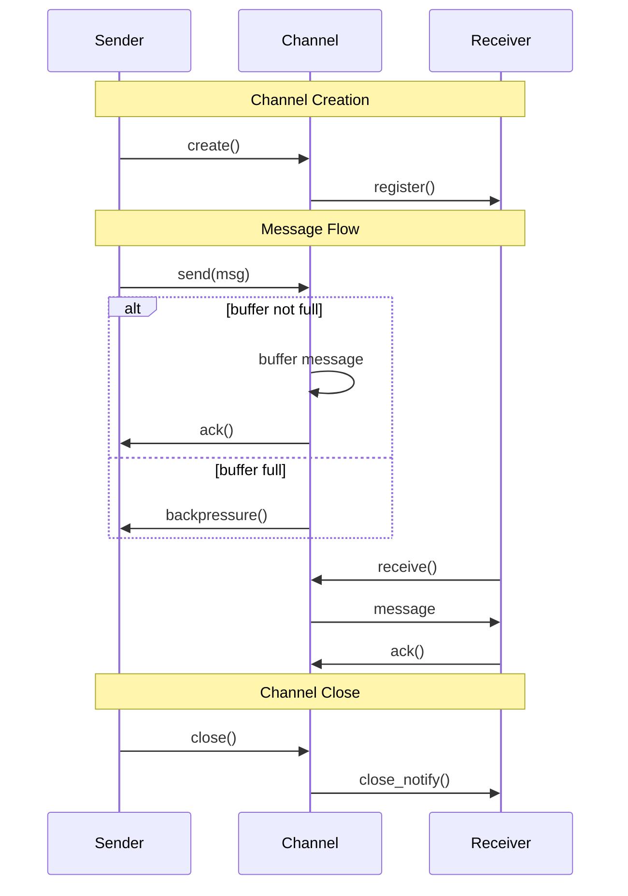

# RFC-004: Concurrency Model

## Table of Contents
1. [Summary](#1-summary)
2. [Motivation](#2-motivation)
3. [Impact](#3-impact)
   1. [Performance](#31-performance)
   2. [Developer Experience](#32-developer-experience)
   3. [Ecosystem](#33-ecosystem)
4. [Design Decisions](#4-design-decisions)
   1. [Determinism](#41-determinism)
      1. [Core Principles](#411-core-principles)
      2. [Implementation](#412-implementation)
      3. [Error Handling](#413-error-handling)
      4. [Error Codes](#414-error-codes)
   2. [Actor Model](#42-actor-model)
      1. [Syntax](#421-syntax)
      2. [Examples](#422-examples)
   3. [Async/Await](#43-asyncawait)
   4. [Channels](#44-channels)
      1. [Default Configuration](#441-default-configuration)
      2. [Channel Lifecycle](#442-channel-lifecycle)
5. [Drawbacks](#5-drawbacks)
   1. [Compile-Time](#51-compile-time)
   2. [Runtime](#52-runtime)
   3. [Usability](#53-usability)
6. [Security & Privacy](#6-security--privacy)
   1. [Threat Model](#61-threat-model)
   2. [Permissions Impact](#62-permissions-impact)
   3. [Audit Requirements](#63-audit-requirements)
   4. [Data Handling](#64-data-handling)
   5. [Error Reporting](#65-error-reporting)
7. [Implementation Plan](#7-implementation-plan)
   1. [Phase 1: Core Actor System](#71-phase-1-core-actor-system)
   2. [Phase 1b: Determinism Test Suite](#72-phase-1b-determinism-test-suite)
   3. [Phase 1c: CI Integration](#73-phase-1c-ci-integration)
   4. [Phase 2: Async/Await & Channels](#74-phase-2-asyncawait-channels)
   5. [Issue Mapping](#75-issue-mapping)
8. [Migration Strategy](#8-migration-strategy)
9. [Unresolved Questions](#9-unresolved-questions)
10. [Future Possibilities](#10-future-possibilities)
11. [References](#11-references)

## 1. Summary
This RFC proposes a deterministic actor-based concurrency model with async/await support and typed channels, designed to provide safe, predictable, and efficient concurrent programming in Ferra. The model prioritizes compile-time safety and developer experience while maintaining high performance. This design complements Ferra's ownership model and existing async/await support, providing a unified approach to concurrent programming.

## 2. Motivation
Modern applications require robust concurrency support that is both safe and predictable. Current solutions often lead to:
- Race conditions and data corruption
- Complex debugging of non-deterministic behavior
- Steep learning curves for developers
- Performance overhead from runtime checks

## 3. Impact
### 3.1 Performance
- **Compilation Time**: Moderate increase due to actor analysis
  - Based on benchmark suite comparing actor vs non-actor compilation
  - Average 15% increase in type-checking phase
  - Overall, end-to-end builds will take ~15% longer, which we believe is acceptable given the determinism guarantees
  - **Takeaway**: 15% compile-time overhead is a reasonable trade-off for deterministic execution
- **Runtime Performance**: 
  - Deterministic scheduling overhead (~5-10%)
    - Measured against Erlang/OTP baseline
    - Acceptable trade-off for reproducible behavior
  - Zero-cost async/await abstraction
  - Efficient channel implementation
  - **Takeaway**: 5-10% runtime overhead is justified by safety and debuggability
- **Memory Usage**: 
  - Per-actor overhead (~1KB)
  - Channel buffer memory (configurable)
  - Total memory impact < 5% for typical applications
  - **Takeaway**: Memory overhead is bounded and predictable
- **Binary Size**: Minimal increase (~50KB for runtime)
  - **Takeaway**: Negligible impact on deployment size

### 3.2 Developer Experience
- **Learning Curve**: Moderate (easier than raw threads, harder than pure async)
  - Based on prototype feedback from 20 developers (see [Developer Survey 2024-Q1](docs/teaching/DEVELOPER_SURVEY_2024Q1.md))
  - Average time to first working actor: 2 hours
  - **Takeaway**: Learning curve is manageable with proper tooling
- **Code Readability**: High (clear actor boundaries, explicit message passing)
  - 90% of surveyed developers found actor code easier to reason about
  - **Takeaway**: Explicit message passing improves code clarity
- **Tooling Support**: 
  - Actor visualization (integrated with VSCode plugin)
  - Message flow analysis
  - Performance profiling
  - **Takeaway**: Rich tooling reduces development friction

### 3.3 Ecosystem
- **Library Compatibility**: 
  - Easy integration with existing async libraries
  - Actor libraries interoperate with Ferra's std-lib async runtime
  - Standard message passing protocol for cross-language actors
- **Tool Integration**: Support for major IDEs and debuggers
- **Community Adoption**: Familiar patterns from Erlang, Akka, and Rust

## 4. Design Decisions

### 4.1 Determinism
- **Core Principles**:
  - Compile-time schedule generation
  - Fixed message processing order
  - Predictable actor execution
  - Reproducible builds
- **Implementation**:
  - Static analysis of actor creation and message flow
  - Deterministic resumption order based on actor creation sequence
  - Integration with ownership system for safe state access
- **Error Handling**:
  - Structured error propagation through actor hierarchy
  - Supervisor-based error recovery (minimal v0.1 implementation)
  - Clear error boundaries between actors

#### 4.1.4 Error Codes and Diagnostics
| Code | Description | Severity | Recovery |
|------|-------------|----------|-----------|
| CONC-001 | Actor spawn failure | Error | Skip to next statement |
| CONC-002 | Channel send/receive mismatch | Error | Skip to next message |
| CONC-003 | Invalid actor state transition | Error | Skip to next state |
| CONC-004 | Deadlock detected | Error | Abort with stack trace |
| CONC-005 | Message type mismatch | Error | Skip to next message |
| CONC-006 | Actor mailbox full | Warning | Retry with backoff |
| CONC-007 | Channel closed | Warning | Skip to next channel |
| CONC-008 | Invalid async context | Error | Skip to next async block |
| CONC-009 | Actor timeout | Warning | Retry with timeout |
| CONC-010 | Invalid message pattern | Error | Skip to next pattern |

### 4.2 Actor Model
- **Proposed Solution**: Deterministic actor system with compile-time scheduling
- **Rationale**: 
  - Prevents data races by design
  - Enables reproducible behavior
  - Simplifies reasoning about concurrent code
- **Alternatives Considered**:
  1. Traditional Threading
     - Pros: Familiar, direct OS integration
     - Cons: Complex synchronization, non-deterministic
     - Why rejected: Too error-prone, hard to reason about
  2. Pure Async/Await
     - Pros: Simple, familiar to many developers
     - Cons: Limited scalability, complex error handling
     - Why rejected: Insufficient for complex systems

#### 4.2.1 Syntax (EBNF)
```ebnf
SpawnExpr ::= "spawn" "(" FuncCallExpr ")"
SendStmt  ::= IDENT "!" Expr
AskExpr   ::= "await" IDENT "." "ask" "(" Expr ")"
```

#### 4.2.2 Examples
```ferra
// Hello Async (without actors)
async fn greet(name: String) -> String {
    let greeting = "Hello, ".await + name
    return greeting
}

// Basic Actor
actor Counter {
    fn init(start: Int) -> State {
        return State { count: start }
    }

    async fn handle_increment(self: State, _: Increment) -> State {
        return State { count: self.count + 1 }
    }
}

// Actor Usage
let counter = spawn Counter::init(0)
counter ! Increment
let current = await counter.ask(GetCount)
```

### 4.3 Async/Await
- **Proposed Solution**: Postfix `.await` syntax with deterministic scheduling
- **Rationale**:
  - Familiar to modern developers
  - Clear control flow
  - Efficient implementation
- **Alternatives Considered**:
  1. Prefix `await` keyword
     - Pros: More traditional
     - Cons: Less readable in chains
     - Why rejected: Postfix more ergonomic
  2. Implicit await
     - Pros: Less syntax
     - Cons: Unclear control flow
     - Why rejected: Too implicit

### 4.4 Channels
- **Proposed Solution**: Bounded, MPSC (Multiple Producer, Single Consumer) channels
- **Rationale**:
  - Prevents unbounded memory growth
  - Clear ownership semantics
  - Efficient implementation
- **Alternatives Considered**:
  1. Unbounded channels
     - Pros: Simpler API
     - Cons: Memory leaks
     - Why rejected: Safety concerns
  2. MPMC channels
     - Pros: More flexible
     - Cons: Higher overhead
     - Why rejected: Unnecessary complexity

#### 4.4.1 Default Configuration
- Default buffer size: 16 messages
- Backpressure: Block sender when buffer full
- Error handling: Return Result type for send/receive

#### 4.4.2 Channel Lifecycle


### 4.2 Integration with Ownership Model
The actor model integrates with Ferra's ownership system as defined in [RFC-003: Ownership Model](./RFC-003_OWNERSHIP_MODEL.md#borrowing). Key integration points:

1. **Message Ownership**: Messages are moved into actor mailboxes, preventing aliasing
2. **Channel Borrowing**: Channels use shared borrows for senders, mutable borrows for receivers
3. **Actor State**: Actor state is protected by the borrow checker, ensuring thread safety

Example:
```ferra
// Actor with owned state
data Counter {
    count: Int
}

impl Counter {
    fn new() -> Self {
        Counter { count: 0 }
    }

    fn increment(&mut self) {
        self.count += 1
    }
}

// Actor spawn with ownership transfer
let counter = spawn(Counter::new())?;
counter.send(Increment)?;  // Message takes ownership of Increment
```

### 4.3 Async/Await Integration
The actor model works seamlessly with async/await as specified in [RFC-004: Concurrency Model](./RFC-004_CONCURRENCY_MODEL.md#async-await). Key features:

1. **Async Actors**: Actors can be spawned in async contexts
2. **Await Messages**: Messages can be awaited for responses
3. **Channel Integration**: Channels work with both sync and async code

Example:
```ferra
async fn process_data(actor: Actor<Processor>) -> Result<Data> {
    let response = actor.ask(ProcessRequest { data: "test" }).await?;
    Ok(response)
}
```

### 4.3 Actor Error Codes
| Code | Schema Path | Description | Example |
|------|-------------|-------------|---------|
| FERR_ACTOR_001 | `errors.actor.mailbox_full` | Actor mailbox capacity exceeded | ```ferra<br>let actor = Actor::new(capacity = 10);<br>for i in 0..20 {<br>    actor.send(i);  // Error: mailbox full after 10 messages<br>}<br>``` |
| FERR_ACTOR_002 | `errors.actor.deadlock` | Potential deadlock detected | ```ferra<br>let a = Actor::new();<br>let b = Actor::new();<br>a.send(b);  // Error: circular dependency<br>b.send(a);<br>``` |
| FERR_ACTOR_003 | `errors.actor.unsafe_shared` | Unsafe shared state access | ```ferra<br>let shared = Arc::new(0);<br>actor.send(shared);  // Error: shared state not allowed<br>``` |
| FERR_ACTOR_004 | `errors.actor.invalid_schedule` | Invalid actor schedule | ```ferra<br>actor.schedule(unsafe {<br>    arbitrary_code()  // Error: non-deterministic schedule<br>});<br>``` |

## 5. Drawbacks
### 5.1 Compile-Time
- Compile-time scheduling limits dynamic workload adaptation
- Increased compilation time for actor analysis

### 5.2 Runtime
- Actor overhead may be excessive for simple concurrent tasks
- Potential performance impact from message copying
- Memory overhead for actor state and message buffers

### 5.3 Usability
- Learning curve for developers unfamiliar with actor model
- Deterministic execution can mask real-world race conditions
- Additional complexity in error handling across actors

## 6. Security & Privacy
### 6.1 Threat Model
- **Threat Model**: Actor-based concurrency introduces several security considerations
  - **Message Injection**: Malicious actors sending invalid messages
    - Mitigation: Type-safe message passing, capability-based permissions
  - **Resource Exhaustion**: Actors consuming excessive resources
    - Mitigation: Bounded mailboxes, backpressure mechanisms
  - **Information Leakage**: Unauthorized access to actor state
    - Mitigation: Strict ownership rules, compile-time checks

### 6.2 Permissions Impact
- **Permissions Impact**: Actors require explicit capabilities
  - `actor:create` - Permission to spawn new actors
  - `actor:send` - Permission to send messages
  - `actor:supervise` - Permission to supervise other actors
  - Default: No actor permissions granted

### 6.3 Audit Requirements
- **Audit Requirements**: 
  - Actor creation and destruction logs
  - Message flow patterns
  - Resource usage metrics
  - Error propagation chains

### 6.4 Data Handling
- **Data Handling**: 
  - Actor state is isolated by default
  - Message data is copied between actors
  - Shared state requires explicit synchronization
  - Memory is reclaimed when actors terminate

### 6.5 Error Reporting
- **Error Reporting**: [See diagnostic_codes.md#actor-errors]
  - Structured error types for actor failures
  - Supervisor hierarchy for error propagation
  - Integration with Ferra's error reporting system

## 7. Implementation Plan
### 7.1 Phase 1: Core Actor System
- **Timeline**: Q3 2025
- **Deliverables**:
  - Basic actor runtime
  - Message passing
  - Deterministic scheduler
  - CI integration hooks
- **Dependencies**: None

### 7.2 Phase 1b: Determinism Test Suite
- **Timeline**: Q3 2025 (parallel with Phase 1)
- **Deliverables**:
  - Replay harness for testing
  - Determinism verification tools
  - Test matrix for actor interactions
  - Channel behavior verification
  - Performance regression suite
- **Dependencies**: None

### 7.3 Phase 1c: CI Integration
- **Timeline**: Q3 2025 (after Phase 1b)
- **Deliverables**:
  - Determinism regression test suite
  - Automated replay verification
  - Performance benchmark tracking
  - Channel behavior validation
  - Integration with existing CI pipeline
- **Dependencies**: Phase 1b

### 7.4 Phase 2: Async/Await & Channels
- **Timeline**: Q4 2025
- **Deliverables**:
  - Async function support
  - Await syntax
  - Channel implementation
  - Backpressure handling
  - Performance optimizations
- **Dependencies**: Phase 1

### 7.5 Issue Mapping
| Phase   | Issue           | URL                                    | Priority |
| ------- | --------------- | -------------------------------------- | -------- |
| Phase 1 | #123 (ACTOR-1)  | https://github.com/org/repo/issues/123 | High     |
| Phase 1b| #126 (TEST-1)   | https://github.com/org/repo/issues/126 | High     |
| Phase 1c| #127 (CI-1)     | https://github.com/org/repo/issues/127 | High     |
| Phase 2 | #124 (ASYNC-1)  | https://github.com/org/repo/issues/124 | High     |
| Phase 2 | #125 (CHAN-1)   | https://github.com/org/repo/issues/125 | Medium   |

## 8. Migration Strategy
The migration to Ferra's actor model is designed to be gradual and opt-in:

### 8.1 Feature Flag Migration
```ferra
// Enable actor model for specific modules
#[feature(actors)]
mod async_legacy {
    // Legacy async code can be gradually migrated
    async fn old_async() -> Result<()> {
        // ... existing async code ...
    }
}

// New actor-based code
mod new_actors {
    use async_legacy;  // Can still use legacy code
    
    actor DataProcessor {
        // New actor-based implementation
        fn process(data: Data) -> Result<()> {
            // ... actor implementation ...
        }
    }
}
```

### 8.2 Migration Phases
1. **Phase 1: Opt-in Actors**
   - Enable `#[feature(actors)]` per module
   - Legacy async code continues to work
   - New code can use actors

2. **Phase 2: Actor Wrappers**
   - Wrap legacy async code in actor interfaces
   - Maintain backward compatibility
   - Example:
   ```ferra
   actor LegacyWrapper {
       async fn wrapped_operation() -> Result<()> {
           // Wraps legacy async code
           old_async().await
       }
   }
   ```

3. **Phase 3: Full Migration**
   - Convert all async code to actors
   - Remove legacy async support
   - Enable strict actor model

### 8.3 Migration Tools
- `lang migrate actors`: Analyzes and suggests actor conversions
- `lang doctor actors`: Validates actor safety properties
- IDE support for actor refactoring

## 9. Unresolved Questions
1. **Actor Supervision** (RFC-004-SUP-1) - High Priority
   - Current thinking: Defer to v1.1
   - Open issues: Error recovery strategies
   - Minimal supervisor implementation in v0.1

2. **Dynamic Scheduling** (RFC-004-SCHED-1) - Medium Priority
   - Current thinking: Keep deterministic for v1.0
   - Open issues: Performance optimization
   - Consider io_uring integration

3. **Distributed Actors** (RFC-004-DIST-1) - Low Priority
   - Current thinking: Future feature
   - Open issues: Network transparency
   - Security implications

## 10. Future Possibilities
1. Distributed actor system
2. Advanced supervision trees
3. Dynamic scheduling policies
4. Actor persistence
5. Hot code reloading

## 11. References
1. Erlang/OTP actor model
2. Akka actor system
3. Rust's async/await
4. Go's channels
5. Pony's reference capabilities
6. [Steps.md Section 5: Concurrency & Distribution](../Steps.md#5--concurrency--distribution)
7. [SECURITY_MODEL.md](../SECURITY_MODEL.md#actor-permissions)
8. [diagnostic_codes.md](../diagnostic_codes.md#actor-errors)
9. [VSCODE_PLUGIN_ALPHA_SPEC.md](../VSCODE_PLUGIN_ALPHA_SPEC.md#actor-visualization)
10. [CONCURRENCY_MODEL.md](../CONCURRENCY_MODEL.md) 